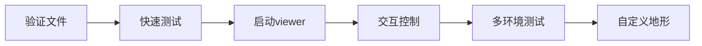

# 🚀 AMO on USD Terrain - Quick Reference Card

一页搞定！AMO策略在Scene.usd地形上的快速参考。

---

## ⚡ 最快开始（复制粘贴）

```bash
cd /home/ununtu/code/glab/genesislab

# 1. 快速测试（50步，无viewer）
./third_party/genPiHub/scripts/amo/test_amo_usd_quick.sh

# 2. 启动viewer（推荐）
python third_party/genPiHub/scripts/amo/play_amo_usd_terrain.py --viewer

# 3. 交互控制（最好玩）
python third_party/genPiHub/scripts/amo/play_amo_usd_terrain.py --viewer --interactive
```

---

## 🎮 交互控制键盘映射

| 键 | 功能 | 键 | 功能 |
|---|------|---|------|
| `W` | 前进 ⬆️ | `S` | 后退 ⬇️ |
| `A` | 左转 ↶ | `D` | 右转 ↷ |
| `E` | 左移 ⬅️ | `C` | 右移 ➡️ |
| `Z` | 升高 ⬆️ | `X` | 降低 ⬇️ |
| `Q` | 退出 🛑 | | |

---

## 📋 常用命令速查

### 基础用法

```bash
# 默认 - 前进0.3m/s
python third_party/genPiHub/scripts/amo/play_amo_usd_terrain.py --viewer

# 更快速度 - 前进0.5m/s
python third_party/genPiHub/scripts/amo/play_amo_usd_terrain.py --viewer --vx 0.5

# 多环境 - 4个机器人
python third_party/genPiHub/scripts/amo/play_amo_usd_terrain.py --viewer --num-envs 4
```

### 进阶用法

```bash
# 自定义地形
python third_party/genPiHub/scripts/amo/play_amo_usd_terrain.py \
    --viewer --usd-path /path/to/your/terrain.usd

# 无头模式（服务器）
python third_party/genPiHub/scripts/amo/play_amo_usd_terrain.py \
    --headless --max-steps 1000

# 完整配置
python third_party/genPiHub/scripts/amo/play_amo_usd_terrain.py \
    --viewer --interactive --num-envs 4 --env-spacing 12.0 --vx 0.4
```

---

## 🔧 关键参数速查表

| 参数 | 默认值 | 说明 | 推荐值 |
|------|--------|------|--------|
| `--viewer` | False | 启用3D可视化 | 必加！ |
| `--interactive` | False | 键盘控制 | 推荐 |
| `--num-envs` | 1 | 环境数量 | 1-4 |
| `--env-spacing` | 10.0 | 环境间距(米) | 8-15 |
| `--vx` | 0.3 | 前向速度(m/s) | 0.2-0.5 |
| `--max-steps` | 100000 | 最大步数 | 按需 |
| `--usd-path` | Scene.usd | 地形文件 | 按需 |

---

## ✅ 快速验证清单

**开始前检查：**

```bash
# 1. USD地形文件
ls third_party/genPiHub/data/assets/CWDL_LW_Assets_20260310/Scene.usd

# 2. AMO模型
ls data/AMO/amo_jit.pt
ls data/AMO/adapter_jit.pt

# 3. Python环境
python -c "import genesis; import genPiHub; print('OK')"
```

---

## 🐛 问题排查1分钟

| 错误 | 解决方案 |
|------|----------|
| USD file not found | 检查路径或用`--usd-path`指定 |
| AMO model not found | 确保`data/AMO/`有模型文件 |
| No module 'genPiHub' | `cd third_party/genPiHub && pip install -e .` |
| CUDA out of memory | 加`--num-envs 1`或`--device cpu` |

---

## 📁 文件位置

```
genesislab/
├── AMO_USD_TERRAIN_GUIDE.md                           ← 📖 完整指南
├── QUICK_REFERENCE_AMO_USD.md                         ← 📄 本文件
├── third_party/genPiHub/
│   ├── scripts/amo/
│   │   ├── play_amo_usd_terrain.py                   ← 🎬 主脚本
│   │   ├── test_amo_usd_quick.sh                     ← 🧪 快速测试
│   │   └── README_USD_TERRAIN.md                     ← 📝 详细文档
│   └── data/assets/CWDL_LW_Assets_20260310/
│       └── Scene.usd                                  ← 🗺️ USD地形
└── data/AMO/                                          ← 🤖 AMO模型
    ├── amo_jit.pt
    ├── adapter_jit.pt
    └── adapter_norm_stats.pt
```

---

## 🎯 典型使用流程



1. ✅ **验证环境** - 检查USD和AMO文件
2. ✅ **快速测试** - 运行test脚本
3. ✅ **启动viewer** - 可视化查看
4. ✅ **交互控制** - 手动操控机器人
5. ✅ **多环境** - 并行测试
6. ✅ **自定义** - 使用自己的地形

---

## 💻 终端命令模板

**复制到终端直接用：**

```bash
# ========== 基础测试 ==========
cd /home/ununtu/code/glab/genesislab
python third_party/genPiHub/scripts/amo/play_amo_usd_terrain.py --viewer

# ========== 交互模式 ==========
python third_party/genPiHub/scripts/amo/play_amo_usd_terrain.py --viewer --interactive

# ========== 多环境 ==========
python third_party/genPiHub/scripts/amo/play_amo_usd_terrain.py --viewer --num-envs 4 --env-spacing 12.0

# ========== 自定义速度 ==========
python third_party/genPiHub/scripts/amo/play_amo_usd_terrain.py --viewer --vx 0.5

# ========== 无头测试 ==========
python third_party/genPiHub/scripts/amo/play_amo_usd_terrain.py --headless --max-steps 500
```

---

## 📊 性能参考

| 配置 | FPS | 用途 |
|------|-----|------|
| 1 env + viewer | ~50 | 演示、调试 |
| 4 env + viewer | ~40 | 并行测试 |
| 1 env + headless | ~200 | 快速测试 |
| 16 env + headless | ~500 | 批量测试 |

---

## 🎬 期望输出示例

```
================================================================================
🏃 AMO Policy on USD Terrain
================================================================================
✅ USD file found: Scene.usd
✅ Backend: cuda
✅ Policy config: 23 DOFs, 50.0Hz
✅ Environment: 1 envs, 23 DOFs
✅ Ready to run!

Step 000000 | FPS   50.2 | Pos [  0.00,   0.00, 0.750] | Cmd [vx=0.30, vy=0.00, yaw=0.00]
Step 000100 | FPS   50.1 | Pos [  0.45,   0.02, 0.752] | Cmd [vx=0.30, vy=0.00, yaw=0.00]
...
```

---

## 📚 完整文档链接

- 📖 **完整指南**: [`AMO_USD_TERRAIN_GUIDE.md`](AMO_USD_TERRAIN_GUIDE.md)
- 🔧 **USD地形实现**: [`IMPLEMENTATION_SUMMARY.md`](IMPLEMENTATION_SUMMARY.md)
- 📝 **脚本文档**: [`third_party/genPiHub/scripts/amo/README_USD_TERRAIN.md`](third_party/genPiHub/scripts/amo/README_USD_TERRAIN.md)
- 🧪 **USD地形测试**: [`scripts/README_USD_TERRAIN.md`](scripts/README_USD_TERRAIN.md)

---

**打印这页，贴在墙上，随时查阅！** 📌
