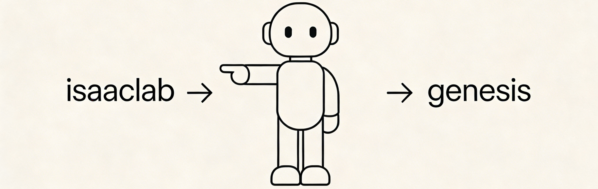

# GenesisLab: Fast and simple to train a robot.

[](./LICENSE)


<p align="center">

</p>

**GenesisLab** is a lightweight **robotics reinforcement learning task suite** built on top of the **Genesis physics engine**.  
It provides a compact framework for **developing RL environments, running large-scale vectorized simulations, and validating observation and reward pipelines**.

The project is intended as a **fast experimentation playground for robotics RL**, emphasizing clarity, modularity, and rapid iteration.

# Demo

Example: **Unitree Go2 velocity tracking policy trained with RSL-RL**

<!-- <p align="center">

</p> -->

Additional environments, benchmarks, and demonstrations will be added as the project evolves.

# Design Philosophy

GenesisLab focuses on providing a **minimal yet practical reinforcement learning experimentation framework** for robotics research.  
Rather than building a large infrastructure, the system emphasizes **readability, modular design, and rapid development cycles**.

<details>
<summary>Core principles</summary>

- **Minimal but complete**  
  The framework includes only the essential components required to construct and train RL environments, avoiding unnecessary abstraction while remaining suitable for real experiments.

- **Readable and hackable implementation**  
  The codebase is intentionally compact so that researchers can understand the system quickly and modify reward functions, observations, or task logic without navigating complex infrastructure.

- **Fast experimentation cycle**  
  Environment templates, simple interfaces, and lightweight configuration allow rapid iteration when designing new RL tasks.

- **Experiment validation first**  
  Built-in debugging utilities and validation scripts help verify simulation stability, observation correctness, and reward behavior before large-scale training.
</details>

<details>
<summary>Key Features</summary>

- **Lightweight RL task framework**  
  Provides a minimal structure for defining reinforcement learning environments while keeping the implementation small and easy to understand.

- **Vectorized simulation support**  
  Enables batched environment execution for efficient data collection and high-throughput reinforcement learning training.

- **Integrated debugging utilities**  
  Includes scripts for validating physics bindings, environment stepping, observation pipelines, and random rollout behavior.

- **Research-friendly architecture**  
  Designed to allow straightforward implementation of new robotics tasks, reward functions, and observation structures.

</details>

# Supported Hardware

GenesisLab inherits hardware compatibility directly from the **Genesis physics engine**.  
Any device supported by Genesis is therefore supported by GenesisLab.

<details>
<summary>Typical supported configurations include:</summary>

- **CPU execution** for debugging, development, and lightweight experiments.
- **GPU-accelerated simulation** for large-scale vectorized reinforcement learning.
- **Parallel multi-environment training** for high-throughput policy optimization.

Hardware compatibility follows the official Genesis runtime environment and backend implementations.

</details>

# Installation

## Option A: uv (Recommended)

[uv](https://docs.astral.sh/uv/) provides faster dependency resolution and reproducible environments.

```bash
# One-command setup: creates venv, installs all deps and third-party repos
bash scripts/setup/setup_uv.sh

# Download assets (optional, required for running tasks)
bash scripts/setup/download_assets.sh

# Activate
source .venv/bin/activate
```

Or step by step:

```bash
# 1. Create venv and install all dependencies
uv venv .venv --python 3.10
uv sync

# 2. Clone and install third-party repos
git clone --branch v3.1.2 --depth 1 https://github.com/leggedrobotics/rsl_rl.git third_party/rsl_rl
uv pip install -e third_party/rsl_rl

# 3. (Optional) genPiHub — only needed for imitation / pretrained-policy tasks.
#     Public repo; requires SSH access to GitHub.
git clone git@github.com:Renforce-Dynamics/genPiHub.git third_party/genPiHub
uv pip install -e third_party/genPiHub

# 4. Download assets (optional)
bash scripts/setup/download_assets.sh

# 5. Activate
source .venv/bin/activate
```

> **Note on `genPiHub`.** It's only required for scripts that load pretrained
> policies (AMO / CLOT / BeyondMimic / HoloMotion). The Go2 velocity-tracking
> training example below does **not** need it — you can skip step 3 and come
> back to it later.

## Option B: conda + pip

```bash
# 1. Create environment
conda create -n genesislab python=3.10
conda activate genesislab

# 2. Install Genesis engine
pip install genesis-world
# Optional: pip install genesis-world[usd]

# 3. Install GenesisLab source packages
bash scripts/setup/setup_ext.sh

# 4. Install third-party extensions
bash third_party/setup_third_party.sh
```

# Training Example

Train a **Go2 flat velocity tracking policy** using the integrated RSL-RL pipeline.

```bash
python scripts/reinforcement_learning/rsl_rl/train.py \
  --env-id Genesis-Velocity-Flat-Go2-v0 \
  --num-envs 4096 \
  --num-iters 3000
```

## Policy Visualization

Render a trained policy and visualize the behavior in a simulation window.

```bash
python scripts/reinforcement_learning/rsl_rl/play.py \
  --env-id Genesis-Velocity-Flat-Go2-v0 \
  --window \
  --num-envs 1 \
  --checkpoint <PATH_TO_CHECKPOINT>
```

<detail>
<summary>Engine smoke test</summary>

Verify that the Genesis backend and Python bindings work correctly.

```bash
python scripts/test/test_engine.py --backend cpu --num-envs 4
```
</detail>

<detail>
<summary>Environment validation</summary>

Run sanity checks to verify stepping logic and vectorized rollouts.

```bash
python scripts/test/test_env_vectorized.py
python scripts/test/test_env_random_rollout.py
```
</detail>

# Citation

If GenesisLab is used in academic research or open-source projects, please consider citing or referencing this repository.

```
@software{zheng2026@genesislab,
  author = {Ziang Zheng},
  title = {GenesisLab: Fast and simple to train a robot..},
  url = {https://github.com/Renforce-Dynamics/genesislab},
  year = {2026}
}
```

# License

This project is released under the **BSD-3-Clause License**.
See the `LICENSE` file for details.


# Appendix

<details>
<summary>Project directory overview</summary>

```
genesislab
├── source/genesislab
│   ├── cli/                 # command line utilities
│   ├── engine/              # Genesis physics bindings
│   ├── envs/                # RL environment wrappers
│   └── tasks/               # task definitions
│
├── scripts
│   ├── setup
│   │   └── setup_ext.sh
│   └── test
│       ├── test_engine.py
│       ├── test_env_vectorized.py
│       └── test_random_rollout.py
│
├── README.md
└── pyproject.toml
```

</details>

<details>
<summary>Adding new RL tasks</summary>

GenesisLab is designed to make task development straightforward.
A typical workflow for implementing a new RL environment is:

1. Duplicate an existing task as a template.
2. Implement observation and reward logic.
3. Add a validation script in `scripts/test`.
4. Run sanity checks before launching large-scale training.

Recommended validation scripts:

```
test_engine.py
test_env_vectorized.py
test_random_rollout.py
```

These scripts help ensure environment reset logic, observation generation, and rollout stability behave correctly.

</details>

<details>
<summary>Planned extensions</summary>

* additional locomotion environments
* manipulation tasks based on Genesis
* improved debugging and visualization utilities
* additional reinforcement learning algorithm integrations

</details>
